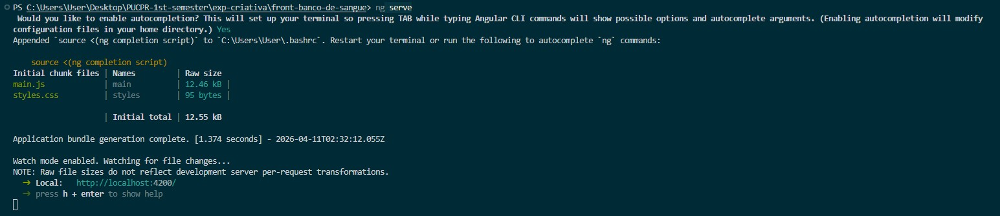
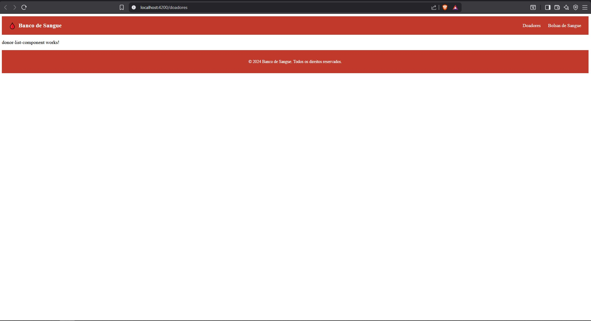
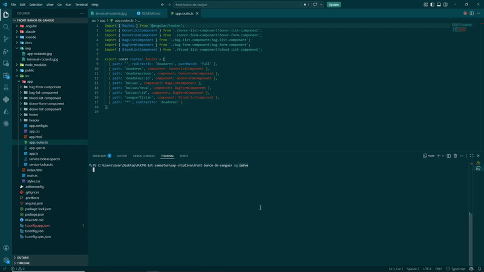

## Documentação Front-End

### Figma

https://www.figma.com/design/KT6bJlgudJQS4pJPCaN9wZ/App-de-Sangue?node-id=33-13&t=KSCSTlybVZQc0osZ-1

### [>>Tabela de Mapeamento<< CLIQUE OU MORRA](docs/tabela-de-mapeamento.md)

## Semana 4

### Print do terminal rodando

### Print do app rodando

## Semana 5

### GIF mostrando o fluxo das páginas até agora

