[< Voltar](../README.md)

# Prints do Postman

Alguns prints dos testes realizados no Postman. Não inclui todos os testes para todos os tipos, mas abrange de modo geral o funcionamento do sistema atualmente.

---

## Rota `/doadores/adicionar`

### Regex — nome com números/caracteres especiais

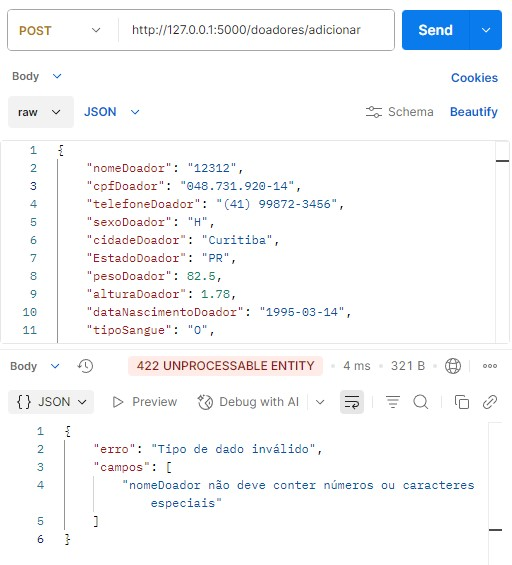

### Sexo do doador inválido

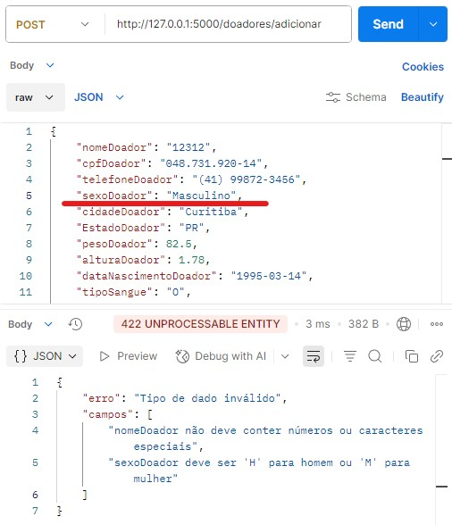

### Tipagem incorreta nos campos

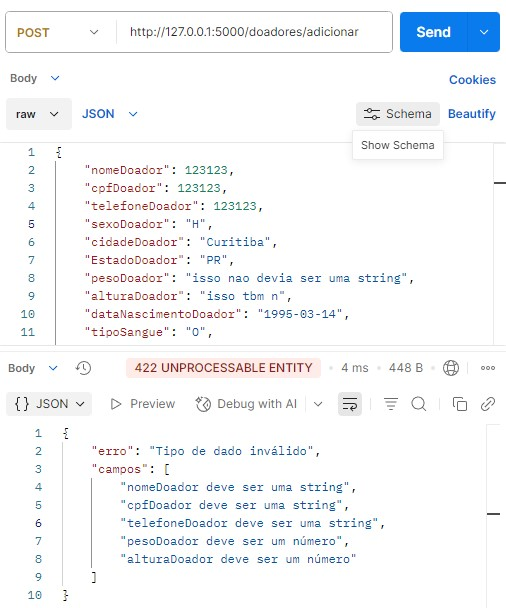

### Campos obrigatórios ausentes

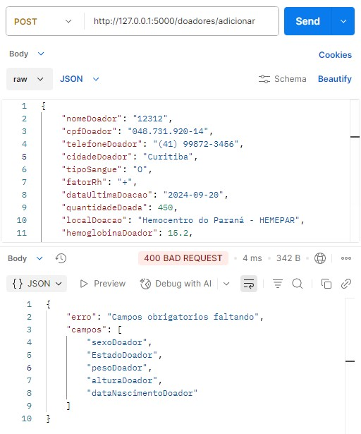

### CPF já cadastrado

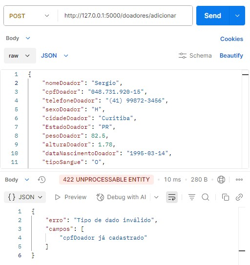

---

## Rota `/bolsas/adicionar`

### Campos obrigatórios ausentes

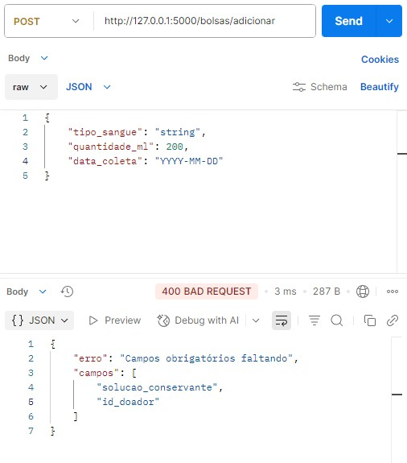

### Tipagem incorreta nos campos

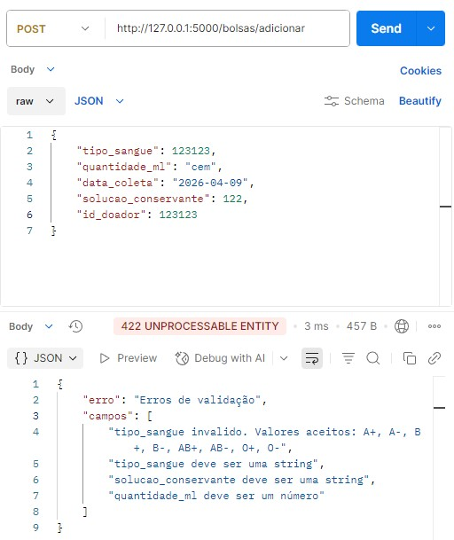

### Tipo de sangue inválido

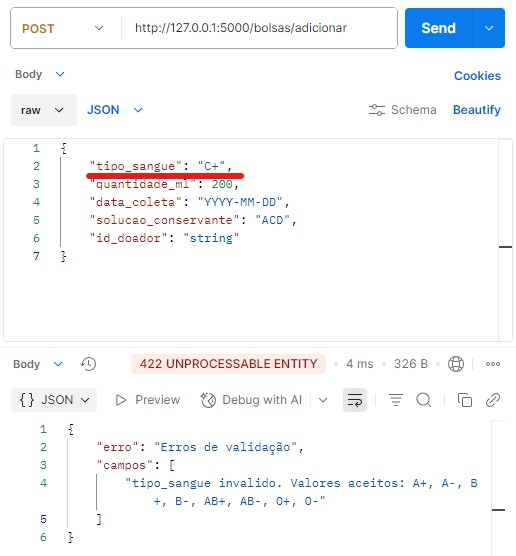

### Data de coleta em formato incorreto

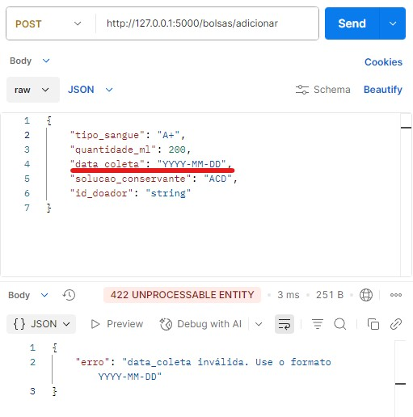

### Quantidade em ml negativa

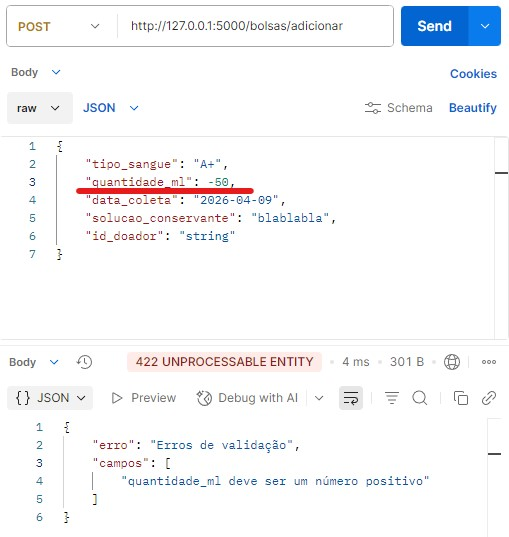

### Solução conservante não reconhecida

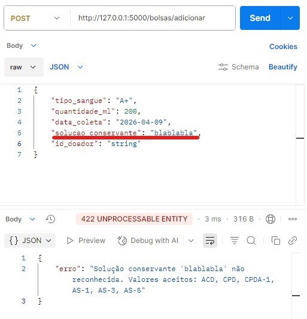
