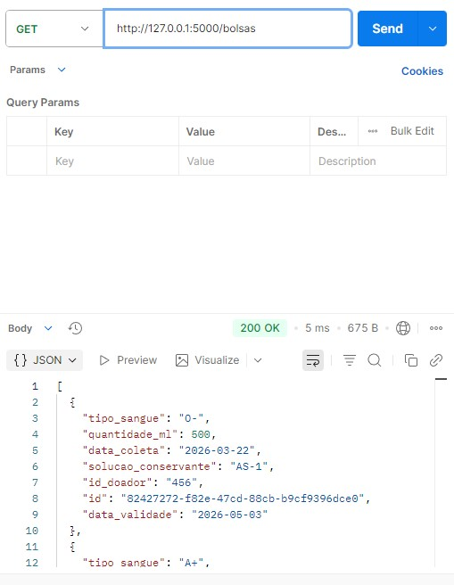
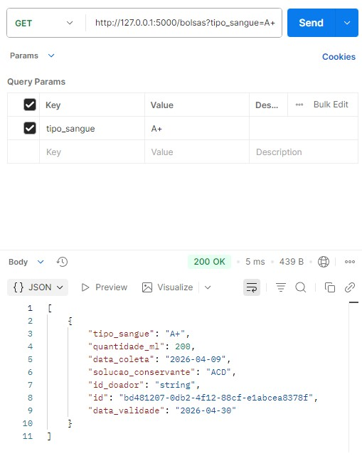
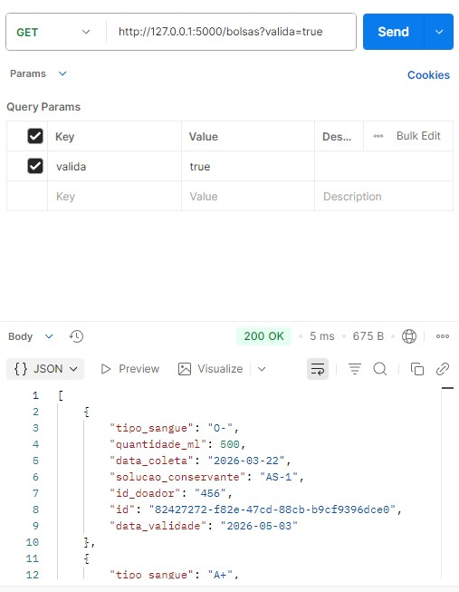
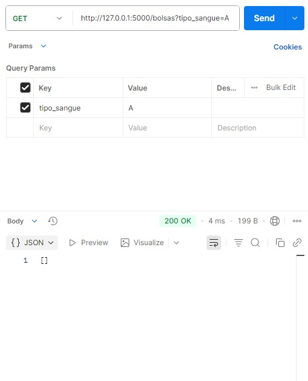
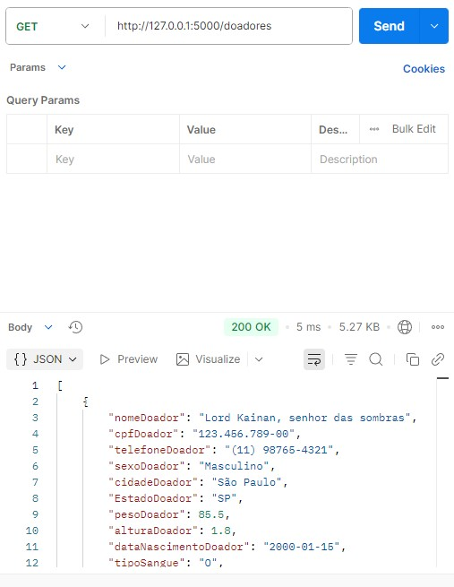
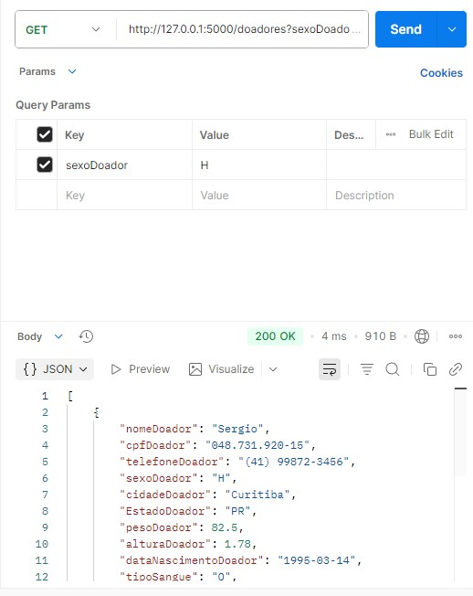
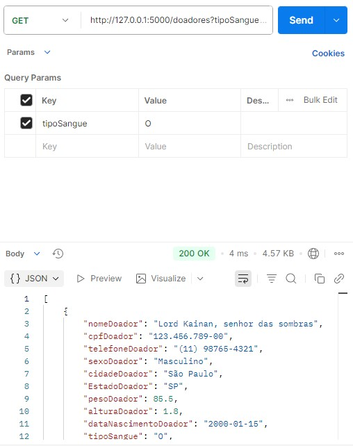
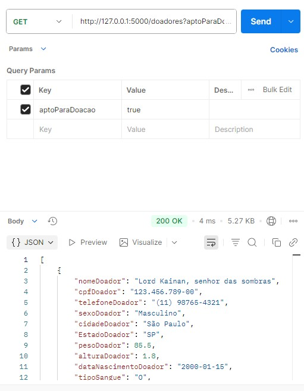
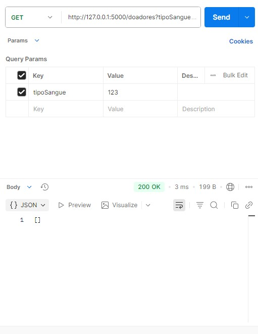

[< Voltar](../README.md)

# Busca por ID:

### Print bolsa ID não existente

### Print bolsa ID encontrado

### Print doador ID não existente

### Print doador ID encontrado

# Busca por filtros com parâmetros:

## Bolsas

### Sem parâmetros

### Filtro por tipo de sangue

### Filtro por validade

### Parâmetro com valor vazio

## Doadores

### Sem parâmetros

### Filtro por sexo

### Filtro por tipo de sangue

### Filtro por aptidão para doação

### Parâmetro com valor vazio

