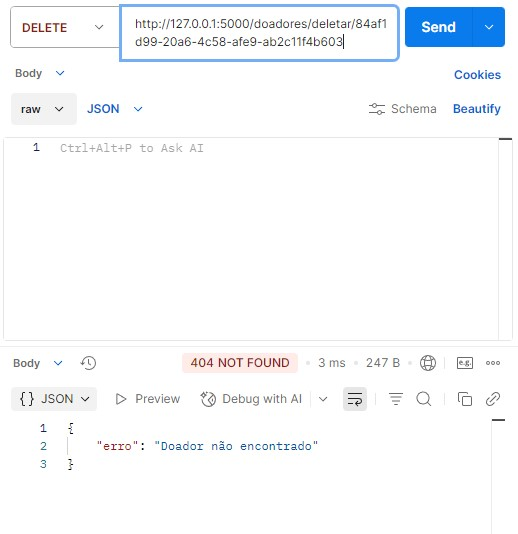
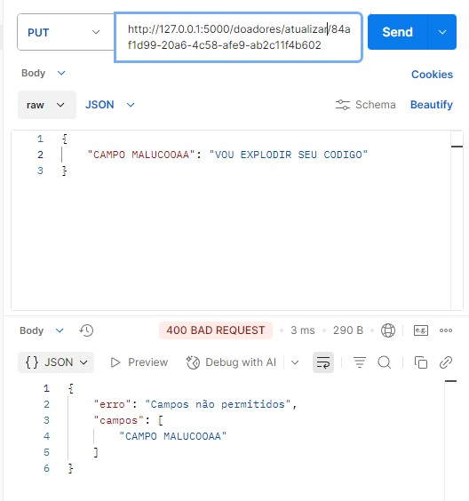
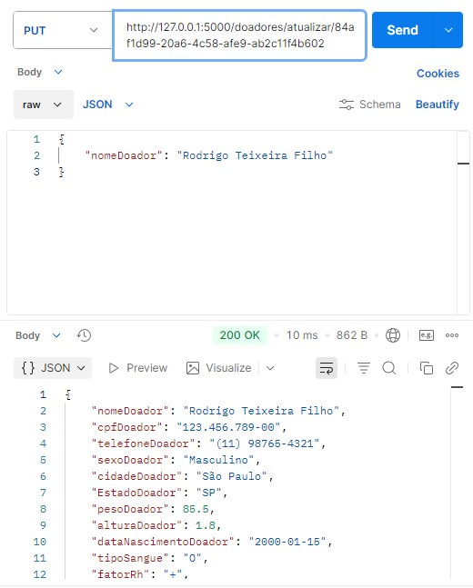
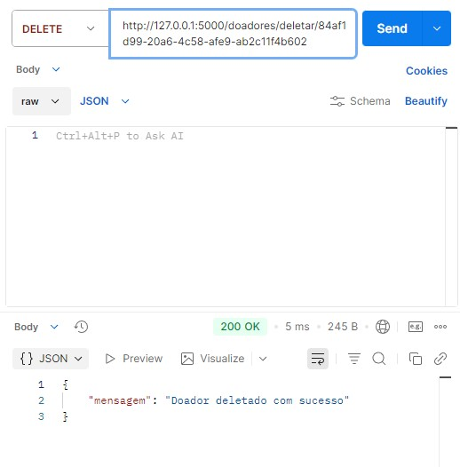

[< Voltar](../README.md)

# PUT:

### Print doador com id não existente:

### Print doador bad request:

### Print nome do doador alterado:

# DELETE:

### Print id não existente

### Print delete com sucesso

